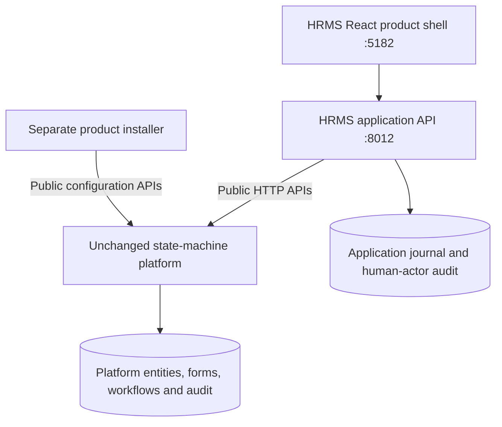

# HRMS application boundary

Updated 2026-09-28. This document supersedes the earlier in-core HRMS implementation notes.

## Ownership

| Location | Responsibility |
| --- | --- |
| `applications/hrms_api/hrms_app/platform.py` | Public platform API client; authentication, tenant checks, complete cursor pagination |
| `applications/hrms_api/hrms_app/service.py` | HRMS aggregation, employee creation orchestration, assignment/dependency and manager checks |
| `applications/hrms_api/hrms_app/catalog.py` | Product entity, form and workflow configuration installed through APIs |
| `applications/hrms_api/hrms_app/role_capabilities.json` | HRMS permissions mapped to native role names; server enforced |
| `applications/hrms_api/hrms_app/reference_options.json` | Initial departments/designations copied from legacy reference defaults; existing employee values also retained |
| `applications/hrms_api/hrms_app/onboarding_template.py` | Versioned eight-step onboarding template and dependencies |
| `applications/hrms_api/hrms_app/journal.py` | Separate PostgreSQL operation checkpoints and human actor audit |
| `frontend/src/skins/hrms_native/` | HRMS entry point, navigation and product pages; reuses native auth and UI foundations |
| Original tracked `backend/` and `frontend/src/` files | Unchanged against baseline `e583a69f7adb0fc5f87a93cd161590ee54bb2ca3` |

The old in-core HRMS adapter and prior core patches are preserved only in the ignored `.hrms-refactor-backup/` directory. Neither is built into the new runtime. The legacy compatibility backend under `backend/hrms/` remains a separate application at port 5181; core `main.py` does not import it.

## APIs and data

All paths below are relative to `/v1/api` on the application API. The application does not import core managers/models or access core tables at runtime.

| Application API | Native public APIs used |
| --- | --- |
| `GET /hrms/employees` | Entity summary cursor reads, with employee/manager name projections |
| `GET /hrms/employees/form-options` | Employee entities plus product reference configuration and permitted roles |
| `POST /hrms/employees` | Entity create/update, pending auth registration, native role assignment, workflow enrollment |
| `GET /hrms/workflows` | Permission-scoped onboarding, leave and performance projections for the reused core workflow table |
| `GET /hrms/performance` and performance action APIs | Native cycle/goal/review/feedback entities and transitions, assembled with HRMS permission and confidentiality rules |
| `GET /hrms/onboarding` | Employee/case/step entities, workflow enrollments, native users for owner names |
| `POST /hrms/onboarding/{case}/steps/{sequence}/complete` | Native transition on the step entity after owner and prerequisite checks |
| `POST /hrms/onboarding/{case}/complete` | Native case transition after all steps complete and HR permission checks |
| `GET/POST /hrms/leave-requests` | Employee relationships, leave entities and workflow enrollments |
| `GET/POST /hrms/leave-requests/{id}/actions` | Current native state; native transition after employee/manager authorization |

`GET /hrms/employees` is a product-facing projection, not a second employee store. The platform's entities API remains the source of truth. HRMS-specific processing belongs here even when a screen requires several native calls.

The unmodified platform task API requires `background_job:read/write` keys absent from its permission catalog. To avoid patching core, onboarding work items are `HRMS.OnboardingStep` entities with an open/completed/cancelled native workflow. Original task IDs and completion times are retained as migration provenance. This is configured product data, not a new core module.

The one-time `tools/migrate_existing_steps.py` is outside the runtime image and gets a read-only source transaction only in its explicit migration job. Target writes use APIs. It copied the existing 16 steps without deleting source rows and resumes missing enrollment. Old generic task URLs are not used by HRMS Quick actions. The product workflow screen offers authorized completion actions directly.

The Workflows page reuses the core `PipelineListTable`, `PipelineListToolbar`, column picker, filtering/sorting hook, terminal toggle and sheet primitives. Its application-owned composition supplies employee names, references, owners, next actions and status from the scoped projection. Opening a row shows the existing HRMS onboarding/leave actions in a detail panel. Column reordering is a local per-user preference rather than a write to native organization settings. UI reuse does not require weakening the API gateway or changing core components. The former two-card shortcut page has been removed.

## Authorization and deployment

Each request validates the real user's active account, organization membership, native roles and tenant. One application deployment is bound to one organization and fails closed for other organizations. A dedicated non-system service identity calls core APIs with explicitly scoped entity/field/workflow grants. It needs native user-write permission to provision identities and assign permitted roles; treat this credential as privileged. It is not assigned to humans and is never returned to the browser. Installer credentials are available only to the separate install/migration/test jobs.

The browser gateway forwards only an explicit authentication/read allowlist with the user's token. Native entity/task/transition/configuration mutations are blocked through that gateway. Core has no exposed host HTTP port. Production must retain this boundary: exposing native mutation endpoints to HRMS users would let old tenant role grants bypass product-level rules. Platform administrators remain trusted operators through a separate controlled administration path.

Core audit records identify the application service caller. The application audit independently records the authenticated human's intent and completion. Both are needed for traceability; no claim is made that core audit impersonates the human.

The HRMS database stores no employee master data: only operation keys, payload fingerprints, progress/results and audit entries. Tenant advisory locks serialize mutations across workers. A create retry finds its native operation marker, preventing duplicate entities; ambiguous outcomes without a matching entity stop for reconciliation. Multi-API operations are not distributed transactions. An operator recovery UI, durable outbox and automated reconciliation are still production work.

## Local operation and verification

Run `powershell -NoProfile -File scripts/hrms-local.ps1 native-up` from the repository. It builds this project's core, application and web images, runs API-only installation, and starts localhost:5182. Sign in with `hrms-admin@newtuple.com` and the ignored environment file's `HRMS_PLATFORM_ADMIN_PASSWORD`. Secrets are generated locally and are not checked in. Existing users retain their roles/passwords.

`native-migrate-steps` migrates prior local onboarding tasks. `native-test` verifies the existing imported demo stack and retains explicitly named test fixtures. Unit tests run using `docker compose --env-file .hrms.local.env -f docker-compose.hrms.yml run --rm --no-deps hrms-app python -m pytest tests -q`.

Validation includes employee creation/replay/conflicting keys, unauthorized access, tenant/membership checks, prerequisite enforcement, all eight native step transitions, final case completion, employee self-approval denial, manager leave approval, and blocked native mutation bypasses. `python scripts/verify-platform-boundary.py` compares all originally tracked backend/frontend core files against the source baseline.

Latest local result (2026-09-28): 24 application tests passed, the complete native performance lifecycle and retry integration check passed, and all 1,416 original core files matched baseline. The frontend type check and production build passed; its reused native authentication modules still produce existing circular-chunk build warnings. The prior step migration rerun reported `source=16 created=0 preserved=16`. An existing completed case with unfinished steps was preserved and is flagged in the UI for reconciliation instead of silently reopened.

## Remaining scope

This refactor migrates the existing employee, onboarding and leave slices. Performance now supports new cycles, goal approval, self/manager review, project feedback, calibration, publication, acknowledgement and audited reassignment through native entities/transitions. See [performance implementation and limits](hrms_performance_management.md). Historical performance import and allocation-driven feedback remain open. HR Cockpit, L&D, policy/holiday publishing, offboarding, projects/allocations, timesheets, assets and helpdesk still require product modules in this layer. Their configuration alone is not completed functionality.

New identities remain pending. Invitation delivery, controlled activation and a general API-only legacy importer must be completed before production onboarding. The previous direct-database import/identity/demo commands were retired. Reference-data administration, formal multi-approver gates, notifications, file handling, migration reconciliation, load testing, operational monitoring/backups, secret management and production SSO are also outstanding. The HRMS Workflows page shows operational cases; it is not the platform workflow designer or administration console.

Future features should add HRMS configuration and application services, call public platform capabilities, and expose product-specific views. A missing generic capability should be proposed separately upstream rather than patched into this HRMS copy of the core.

## Native tenant Settings (2026-09-28)

The HRMS skin reuses native Settings components and the native Funnel Editor through its own routes. No core platform source changes are required. The HRMS `platform:configure` capability is assigned only to Super Admin. Configuration requests pass through an explicit configuration-route allowlist and preserve the human user's authorization token; native RBAC remains authoritative for platform operations. Organization selectors must match the current HRMS tenant. Tenant admins do not gain platform-global organization management.

Settings includes entity forms (the native FormConfigTab), entity types, workflows, fields, users/roles, and the other available native configuration editors. HRMS-specific role policy is shown separately as read-only application configuration. Runtime entity writes, workflow transitions, enrollment and execution endpoints are not opened by this configuration gateway.

Validation: 50 application tests passed, including configuration access, human-token forwarding, cross-organization denial and runtime-mutation denial. The frontend production build passed and the boundary check verified 1416 original core files against the original platform baseline. Local Super Admin API checks confirmed entity types, forms, roles, users, workflows, configuration libraries and audit logs. External integrations still require their normal provider configuration.

## Shared form presentation configuration (2026-09-29)

All currently implemented HRMS data-entry forms use `ConfiguredForm` / `ConfiguredField` in the HRMS skin. Employee, Leave, Customer, Project, Allocation and Performance action forms request the installed native form by its explicit pack schema key through `GET /hrms/forms/{entity_type}`. The HRMS adapter returns current labels, placeholders, required/read-only flags, column span and enumerated/picklist presentation. Native field labels are stored in `description`. The project-only field-label endpoint payload and helper were removed.

Form configuration is fetched again on mount and focus; the native form-change event invalidates the shared cache. Missing/inactive forms fail visibly. Relation selectors map command IDs to configured display-name fields, without exposing unrestricted users or changing stored keys. Performance self/manager/calibration inputs map to their stage-specific fields. Onboarding currently has action buttons, not a data-entry form; its steps still come from the workflow API.

This is presentation binding for existing command fields, not arbitrary runtime schema migration. Required command inputs stay required even if the generic form marks them optional. Identity selectors and fixed business enums remain bounded by permitted options. Adding fields, changing a command's storage type, defaults, calculations or introducing a new form requires HRMS command/persistence support; the presentation adapter does not claim to save these changes. Product-only action inputs without a native field (such as a retry/audit note) retain their own label. Core source stays unchanged.

## Configured workflow presentation (2026-09-29)

Workflow rows now resolve each visible record's actual native enrollment and machine version. State descriptions, order, terminal tags, transition labels and destinations are projected by `workflow_config.py`; repeated definitions are fetched once per response. The skin shares `WorkflowStages` for runtime configuration. Hardcoded Project/Performance stage arrays and the workflow table's terminal-state list are removed. Configured routes are shown separately from authorized HRMS commands. A position in the state list is not evidence that an earlier state was completed; the old inferred completion ticks were removed.

Publish/activate workflow edits using the native editor. Existing records display their enrolled version, not blindly the latest active definition; upgrading existing enrollments requires an explicit migration. Native runtime still validates transitions, guards and required fields at execution. HRMS still validates domain roles, designated approvers and effects. New semantic state keys or triggers need an HRMS command binding; displaying a new transition does not grant an unrestricted generic transition endpoint. Core source is unchanged.
